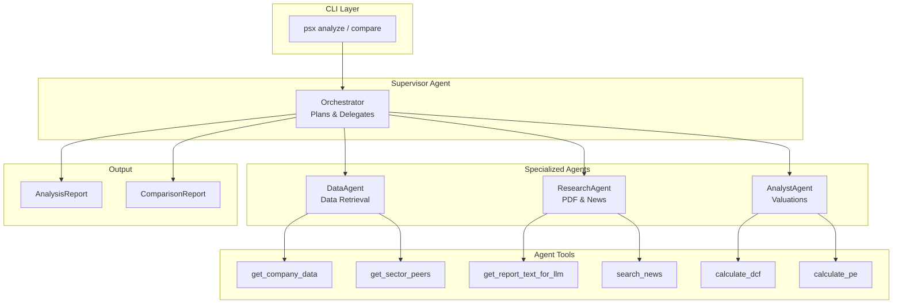
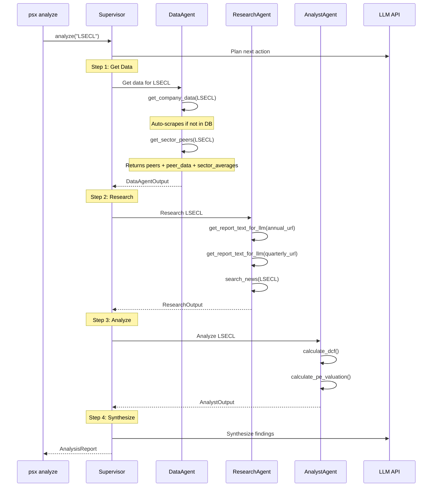
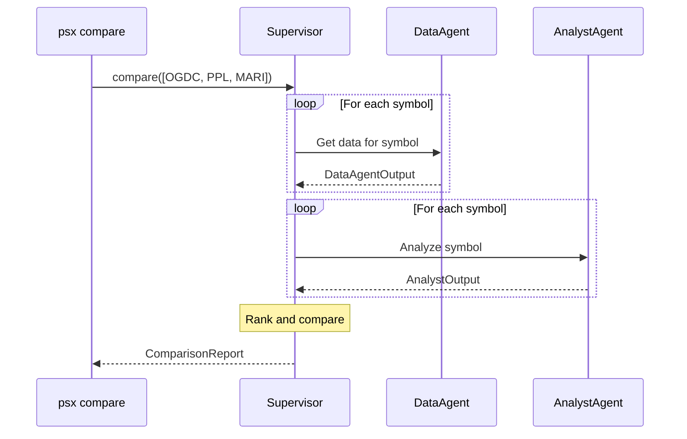
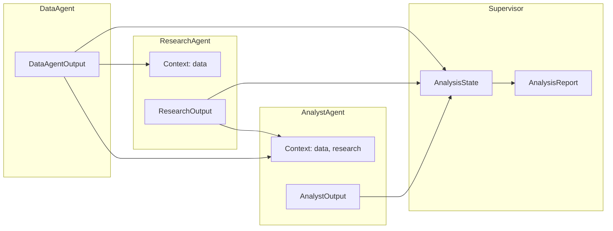
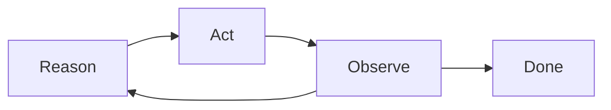

# Agent Layer Documentation

This document describes the multi-agent architecture for AI-powered stock analysis on the PSX Stock Analysis Platform.

## Overview

The agent layer provides:
- **Supervisor Agent** - Orchestrates analysis workflow and delegates to specialists
- **Data Agent** - Retrieves company data from database or scraper
- **Research Agent** - Parses PDFs, searches news
- **Analyst Agent** - Performs valuations and generates recommendations
- **Model-agnostic LLM client** - Supports OpenAI and Anthropic APIs

## Architecture

```
src/psx/agents/
├── __init__.py
├── base.py              # BaseAgent class with tool execution
├── llm.py               # LLM client (OpenAI/Anthropic)
├── supervisor.py        # Orchestrator agent
├── data_agent.py        # Data retrieval agent
├── analyst_agent.py     # Financial analysis agent
├── research_agent.py    # News and PDF research agent
└── schemas.py           # Output dataclasses
```

---

## Agent Workflow

### High-Level Architecture



### Analysis Sequence



### Comparison Sequence



---

## Agent Descriptions

| Agent | Role | Key Tools |
|-------|------|-----------|
| **Supervisor** | Orchestrates workflow, delegates tasks, synthesizes reports | None (uses LLM planning) |
| **DataAgent** | Retrieves company data from DB or scraper | `get_company_data`, `get_sector_peers`, `list_companies` |
| **ResearchAgent** | Parses PDFs, searches news, gathers market intelligence | `get_report_text_for_llm`, `search_news` |
| **AnalystAgent** | Calculates valuations, identifies strengths/risks | `calculate_intrinsic_value`, `calculate_dcf_value`, `compare_to_peers` |

---

## Tool Registry

### DataAgent Tools

| Tool | Description | Parameters |
|------|-------------|------------|
| `get_company_data` | Get full company data (auto-scrapes if not in DB) | `symbol` |
| `get_sector_peers` | Get peers, peer financial data, AND sector averages in one call | `symbol`, `max_peers` |
| `list_companies` | List all companies in database | - |

> **Note:** DataAgent extracts data directly from tool results (not LLM output) for efficiency. The LLM decides which tools to call, but output is built from `tool_results` dict.

### ResearchAgent Tools

| Tool | Description | Parameters |
|------|-------------|------------|
| `get_report_text_for_llm` | Download PDF and get LLM-summarized text | `url`, `max_chars` |
| `search_news` | Search for company news via Tavily | `query`, `max_results` |

> **Note:** PDF summarization uses a dedicated LLM call with `PDF_SUMMARIZER_SYSTEM` prompt to extract key financial information.

### AnalystAgent Tools

| Tool | Description | Parameters |
|------|-------------|------------|
| `calculate_intrinsic_value` | Multi-method intrinsic value (DCF, Graham, DDM, Earnings Power) | `eps`, `book_value`, `dividend`, etc. |
| `calculate_dcf_value` | DCF valuation with configurable assumptions | `free_cash_flow`, `growth_rate`, `discount_rate`, `terminal_growth` |
| `compare_to_peers` | Compare metrics against peer companies | `symbol`, `metric`, `peer_values` |

---

## Data Flow

### Context Passing Between Agents



### DataAgentOutput Context String

When passed to ResearchAgent, includes:
- Current price, P/E ratio, 52-week range
- Company name, sector, description
- **Financials data** (profit, EPS for recent periods)
- **Ratios data** (profit margin, EPS growth)
- **Report URLs** (for PDF parsing)
- **Announcement URLs** (board meetings, material info)
- Sector peers

---

## Output Schemas

### DataAgentOutput

```python
@dataclass
class DataAgentOutput:
    symbol: str
    quote: Optional[QuoteData]
    company: Optional[CompanyData]
    financials: list[FinancialRow]
    ratios: list[RatioRow]
    reports: list[ReportData]        # URLs for PDF parsing
    announcements: list[AnnouncementData]  # URLs for PDFs
    peers: list[str]                 # Peer symbols
    peer_data: list[PeerDataSnapshot]  # Peer financial snapshots
    sector: Optional[str]
    sector_averages: Optional[dict]  # Sector benchmark metrics
    data_gaps: list[str]
    data_freshness: Optional[str]    # "from_database" or "freshly_scraped"
```

### PeerDataSnapshot

```python
@dataclass
class PeerDataSnapshot:
    symbol: str
    name: Optional[str]
    sector: Optional[str]
    price: Optional[float]
    change_pct: Optional[float]
    pe_ratio: Optional[float]
    market_cap: Optional[float]
    eps: Optional[float]
    profit_margin: Optional[float]
    week_52_high: Optional[float]
    week_52_low: Optional[float]
```

### ResearchOutput

```python
@dataclass
class ResearchOutput:
    symbol: str
    news_items: list[NewsItem]
    key_events: list[str]
    report_highlights: list[str]     # Extracted from PDFs
    management_commentary: str       # Key insights from director's report
    risks_identified: list[str]
    opportunities: list[str]
    competitor_insights: dict
```

### AnalystOutput

```python
@dataclass
class AnalystOutput:
    symbol: str
    health_score: float              # 0-100
    valuations: list[ValuationDetail]
    fair_value: Optional[float]
    current_price: Optional[float]
    margin_of_safety: Optional[float]
    red_flags: list[str]
    strengths: list[str]
    peer_comparison: list[PeerComparison]
    recommendation: Recommendation   # STRONG_BUY, BUY, HOLD, SELL, STRONG_SELL
    confidence: float                # 0-1
    reasoning: str
```

### AnalysisReport (Final Output)

```python
@dataclass
class AnalysisReport:
    query: str
    symbols: list[str]
    summary: str
    recommendation: Recommendation
    confidence: float
    data: dict[str, DataAgentOutput]
    research: dict[str, ResearchOutput]
    analysis: dict[str, AnalystOutput]
    key_findings: list[str]
    risks: list[str]
    generated_at: str
```

---

## Logging & Debugging

### Verbose Mode

Enable with `--verbose` flag:

```bash
uv run psx analyze LSECL --verbose
```

Produces:
- Console output with emoji indicators
- Log file saved to `logs/analyze_LSECL_{timestamp}.log`

### Log Format

```
2026-01-02 12:30:15 - psx.agents.supervisor - INFO - Supervisor starting analysis: LSECL
2026-01-02 12:30:15 - psx.agents.supervisor - INFO - [Supervisor] Extracted symbols: ['LSECL']
2026-01-02 12:30:16 - psx.agents.supervisor - INFO - [Supervisor] 📤 Delegating to DATA agent for ['LSECL']
2026-01-02 12:30:17 - psx.agents.base - INFO - [DataAgent] 🔧 Calling tool: get_company_data
2026-01-02 12:30:17 - psx.agents.base - DEBUG - [DataAgent]    Arguments: {"symbol": "LSECL"}
2026-01-02 12:30:17 - psx.agents.base - DEBUG - [DataAgent]    Result: {"symbol": "LSECL", "quote": {...}}
```

### Log Indicators

| Emoji | Meaning |
|-------|---------|
| 📤 | Delegating to agent |
| 📥 | Receiving from agent |
| 🔧 | Calling tool |
| 📊 | Synthesizing report |
| ✅ | Analysis complete |
| ❌ | Error occurred |

---

## Configuration

### Environment Variables

| Variable | Required | Description |
|----------|----------|-------------|
| `OPENAI_API_KEY` | One of these | OpenAI API key for GPT models |
| `ANTHROPIC_API_KEY` | One of these | Anthropic API key for Claude models |
| `TAVILY_API_KEY` | Optional | Tavily API key for web search |
| `PSX_LLM_PROVIDER` | Optional | Force provider: `openai` or `anthropic` |
| `PSX_LLM_MODEL` | Optional | Override model (e.g., `gpt-5.1`, `claude-sonnet-4-5-20250929`) |

### Default Models

| Provider | Default Model |
|----------|---------------|
| OpenAI | `gpt-5.1` |
| Anthropic | `claude-sonnet-4-5-20250929` |

---

## ReAct Pattern

Agents use the ReAct (Reason → Act → Observe) pattern:



1. **Reason**: LLM analyzes task and context
2. **Act**: Execute tool call
3. **Observe**: Process tool result (stored in `tool_results` dict)
4. **Repeat** until task complete or max iterations reached

### Tool Results Direct Access

BaseAgent stores all tool results in `self.tool_results` dict for direct access:

```python
# During execution, tool results are stored:
self.tool_results[tool_call.name] = json.loads(result)

# Subclasses can access tool results directly instead of parsing LLM output
class DataAgent(BaseAgent):
    def run(self, task, context):
        super().run(task, context)  # LLM decides tools
        merged = self._merge_tool_results()  # Extract from tool_results
        return self._parse_to_output(merged)
```

**Benefits:**
- Avoids redundant token usage (LLM doesn't need to copy tool data to output)
- Faster execution (smaller LLM output)
- More reliable (no JSON parsing from LLM-generated text)

### Max Iterations & Tokens

| Agent | Max Iterations | Max Tokens | Notes |
|-------|----------------|------------|-------|
| Supervisor (routing) | 5 | 4096 | Just emits routing JSON |
| Supervisor (synthesis) | - | 8192 | Final report generation |
| DataAgent | 5 | 512 | Minimal output (uses tool_results) |
| ResearchAgent | 7 | 8192 | Detailed research synthesis |
| AnalystAgent | 5 | 8192 | Detailed valuation analysis |

---

## Output Storage

### Directory Structure

```
output/
├── analyze_LSECL_20260102_143025.json
├── analyze_OGDC_20260102_150000.json
├── compare_LSECL_GHNI_20260102_160000.json
└── compare_OGDC_PPL_MARI_20260102_170000.md

logs/
├── analyze_LSECL_20260102_143025.log
├── compare_LSECL_GHNI_20260102_160000.log
└── ...
```

### Output Formats

| Format | Extension | Description |
|--------|-----------|-------------|
| JSON | `.json` | Full structured data (always saved) |
| Markdown | `.md` | Human-readable report (with `--output markdown`) |

---

## File Locations

| Component | Location |
|-----------|----------|
| Base agent class | `src/psx/agents/base.py` |
| LLM client | `src/psx/agents/llm.py` |
| Supervisor agent | `src/psx/agents/supervisor.py` |
| Data agent | `src/psx/agents/data_agent.py` |
| Research agent | `src/psx/agents/research_agent.py` |
| Analyst agent | `src/psx/agents/analyst_agent.py` |
| Output schemas | `src/psx/agents/schemas.py` |
| CLI commands | `src/psx/cli/main.py` |
| PDF parser tool | `src/psx/tools/pdf_parser.py` |
| Calculator tool | `src/psx/tools/calculator.py` |
| Web search tool | `src/psx/tools/web_search.py` |
