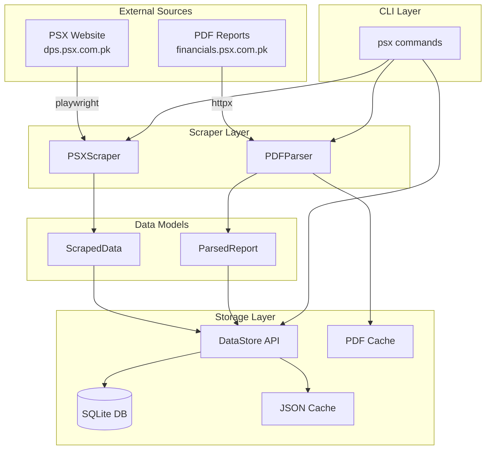
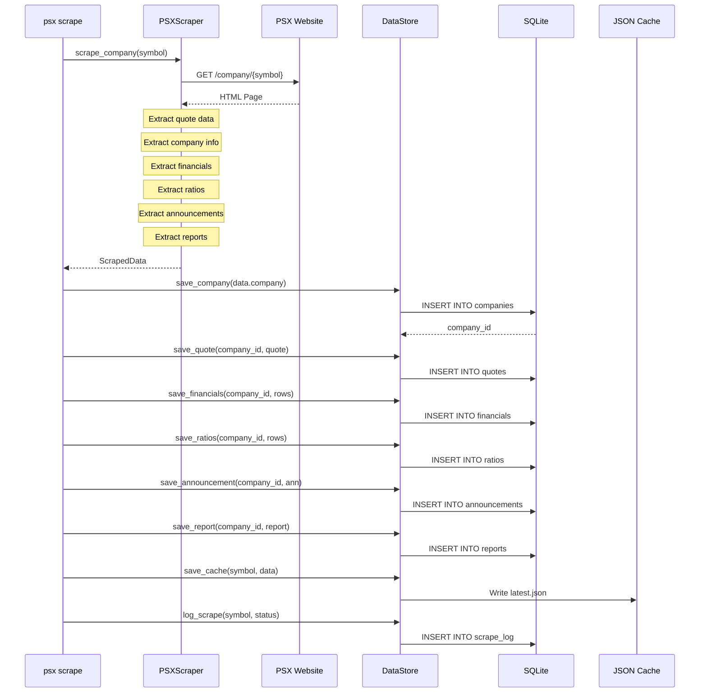
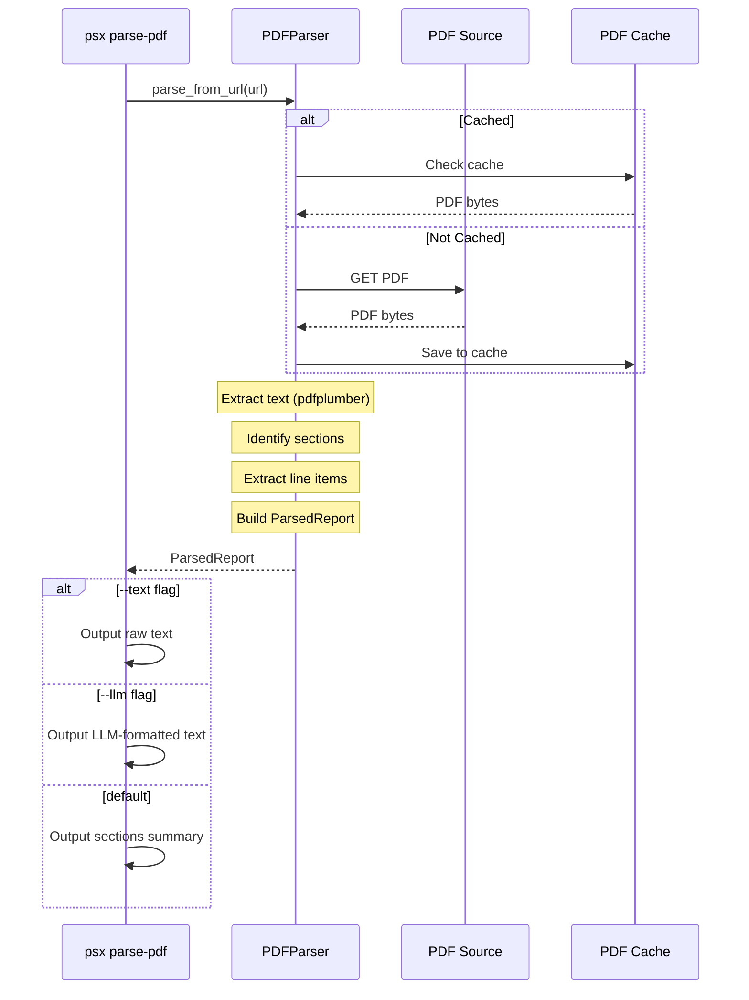
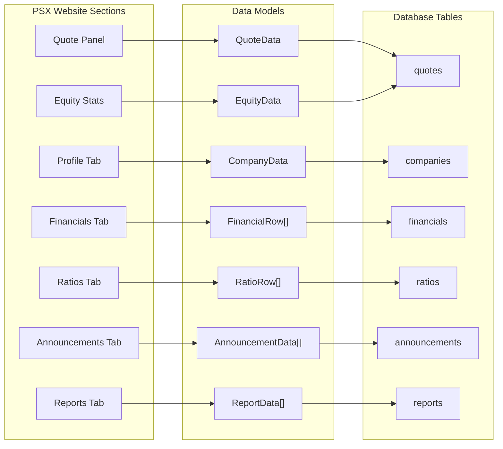
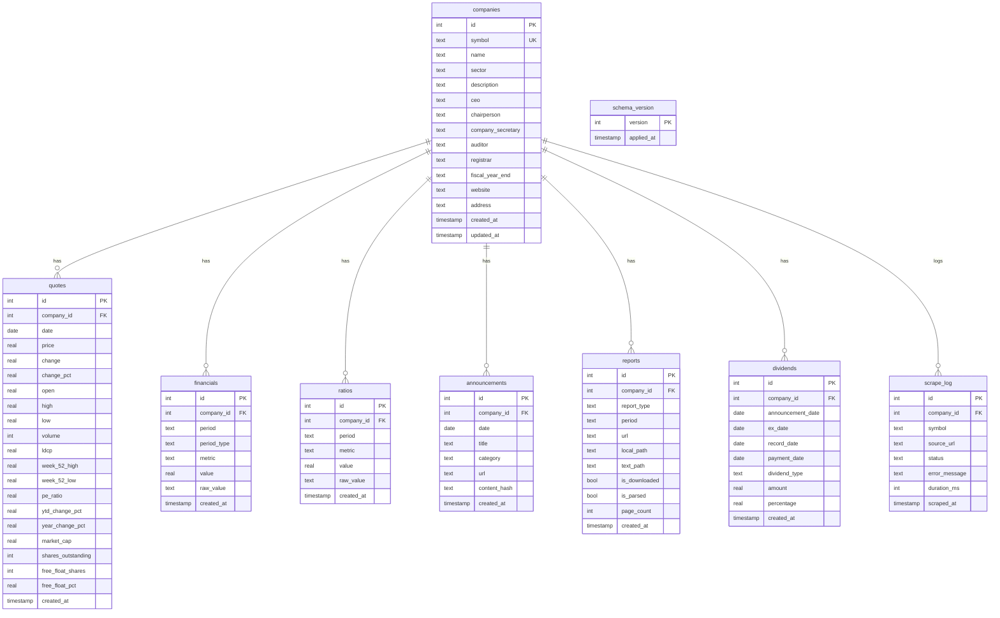
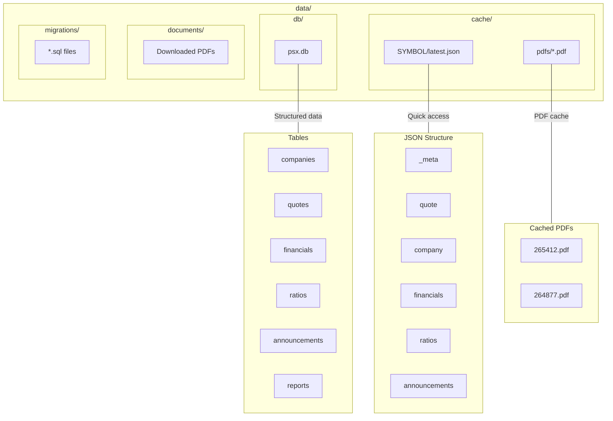
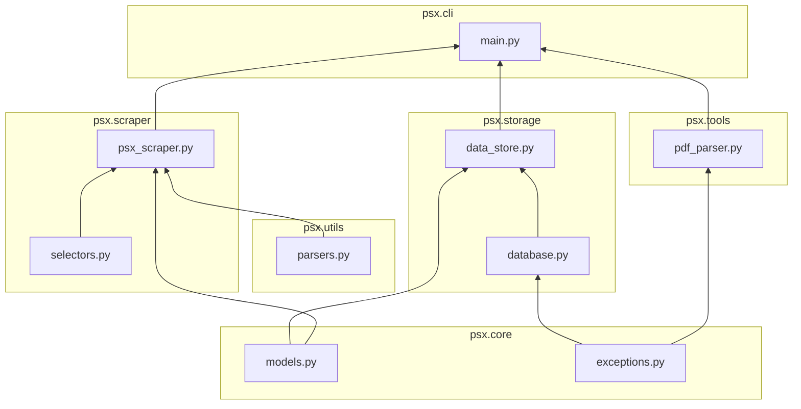

# Data Layer Documentation

This document describes the data storage, schema, and data flow for the PSX Stock Analysis Platform.

## Overview

The data layer provides:
- **SQLite database** for structured financial data
- **JSON cache** for quick access to latest scraped data
- **PDF parser tool** for extracting data from financial reports
- **Unified DataStore API** abstracting all storage operations

## Architecture

```
data/
├── db/
│   └── psx.db              # SQLite database
├── cache/
│   ├── {SYMBOL}/
│   │   └── latest.json     # Cached scraped data per company
│   └── pdfs/               # Cached PDF downloads
├── documents/              # Downloaded PDF reports
└── migrations/
    └── 001_initial_schema.sql
```

---

## Data Flow

### High-Level Architecture



### Scraping Data Flow



### PDF Parsing Data Flow



### Data Model Mapping



---

## Database Schema

### Entity Relationship Diagram



### Table Descriptions

#### Core Tables

| Table | Purpose | Key Constraints |
|-------|---------|-----------------|
| `companies` | Company master data | `symbol` is unique |
| `quotes` | Daily market prices | Unique on `(company_id, date)` |
| `financials` | Financial statement metrics | Unique on `(company_id, period, period_type, metric)` |
| `ratios` | Financial ratios | Unique on `(company_id, period, metric)` |

#### Document Tables

| Table | Purpose | Key Constraints |
|-------|---------|-----------------|
| `announcements` | Company announcements | Deduplicated by `content_hash` |
| `reports` | PDF report metadata | Unique on `(company_id, report_type, period)` |
| `dividends` | Dividend history | None (allows duplicates) |

#### System Tables

| Table | Purpose |
|-------|---------|
| `scrape_log` | Audit trail for scrape operations |
| `schema_version` | Database migration tracking |

### Indexes

```sql
-- Company lookups
CREATE INDEX idx_companies_symbol ON companies(symbol);
CREATE INDEX idx_companies_sector ON companies(sector);

-- Quote queries
CREATE INDEX idx_quotes_date ON quotes(date);
CREATE INDEX idx_quotes_company_date ON quotes(company_id, date);

-- Financial queries
CREATE INDEX idx_financials_company ON financials(company_id);
CREATE INDEX idx_financials_period ON financials(period, period_type);
CREATE INDEX idx_financials_metric ON financials(metric);

-- Ratio queries
CREATE INDEX idx_ratios_company ON ratios(company_id);
CREATE INDEX idx_ratios_metric ON ratios(metric);

-- Announcement queries
CREATE INDEX idx_announcements_company ON announcements(company_id);
CREATE INDEX idx_announcements_date ON announcements(date);
CREATE INDEX idx_announcements_category ON announcements(category);

-- Report queries
CREATE INDEX idx_reports_company ON reports(company_id);
CREATE INDEX idx_reports_type ON reports(report_type);

-- Dividend queries
CREATE INDEX idx_dividends_company ON dividends(company_id);
```

### Unique Constraints

| Table | Constraint | Purpose |
|-------|------------|---------|
| `companies` | `symbol` | One record per stock symbol |
| `quotes` | `(company_id, date)` | One quote per company per day |
| `financials` | `(company_id, period, period_type, metric)` | One value per metric per period |
| `ratios` | `(company_id, period, metric)` | One ratio value per period |
| `announcements` | `(company_id, content_hash)` | Deduplication |
| `reports` | `(company_id, report_type, period)` | One report per type per period |

---

## Components

### 1. Database (`src/psx/storage/database.py`)

Low-level SQLite connection and migration management.

```python
from psx.storage.database import Database, init_database

# Initialize database with migrations
db = init_database("data/db/psx.db", "data/migrations")

# Execute queries
cursor = db.execute("SELECT * FROM companies WHERE symbol = ?", ("LSECL",))
row = cursor.fetchone()

# Close when done
db.close()
```

**Key Methods:**
- `connection` - Lazy connection property
- `execute(sql, params)` - Execute single query
- `executemany(sql, params_list)` - Batch operations
- `commit()` / `rollback()` - Transaction control
- `get_schema_version()` - Current migration version
- `run_migrations(dir)` - Apply pending migrations

### 2. DataStore (`src/psx/storage/data_store.py`)

Unified API for all data operations. Use this instead of direct database access.

```python
from psx.storage.data_store import DataStore
from psx.core.models import CompanyData, QuoteData

store = DataStore()

# Save company
company = CompanyData(symbol="TEST", name="Test Corp", sector="Tech")
company_id = store.save_company(company)

# Save quote
quote = QuoteData(price=10.50, change=0.25, volume=1000000)
store.save_quote(company_id, quote)

# Get data
company = store.get_company("TEST")
latest_quote = store.get_latest_quote("TEST")
financials = store.get_financials("TEST", period_type="annual")
```

### 3. PDF Parser (`src/psx/tools/pdf_parser.py`)

Agent-callable tool for extracting data from PSX financial report PDFs.

```python
from psx.tools.pdf_parser import PDFParser

parser = PDFParser(cache_dir="data/cache/pdfs")

# Parse from URL
report = await parser.parse_from_url("https://dps.psx.com.pk/download/document/265412.pdf")

# Access parsed data
print(f"Pages: {report.pages}")
print(f"Sections: {list(report.sections.keys())}")
print(f"Text: {report.raw_text[:1000]}")

# Get LLM-formatted text
llm_text = parser.get_text_for_llm(report, max_chars=50000)

# Extract line items
balance_sheet = report.sections.get("balance_sheet")
if balance_sheet:
    items = parser.extract_line_items(balance_sheet.raw_text)
    print(f"Total Assets: {items.get('total_assets')}")
```

**CLI Usage:**
```bash
# Parse and show sections
psx parse-pdf https://dps.psx.com.pk/download/document/265412.pdf

# Get raw text
psx parse-pdf <url> --text --max-chars 5000

# Get LLM-formatted output
psx parse-pdf <url> --llm
```

### 4. Number Parsers (`src/psx/utils/parsers.py`)

Utilities for converting PSX formatted strings to machine-readable values.

```python
from psx.utils.parsers import (
    parse_price,      # "Rs.5.17" -> 5.17
    parse_number,     # "1,873,125.59" -> 1873125.59
    parse_negative,   # "(9,235)" -> -9235.0
    parse_percent,    # "-9.14%" -> -9.14
    parse_date,       # "Nov 10, 2025" -> "2025-11-10"
    parse_volume,     # "18,570,325" -> 18570325
)
```

---

## Data Models

All models are defined in `src/psx/core/models.py` as dataclasses:

```python
@dataclass
class QuoteData:
    price: Optional[float] = None
    change: Optional[float] = None
    change_pct: Optional[float] = None
    volume: Optional[int] = None
    pe_ratio: Optional[float] = None
    week_52_high: Optional[float] = None
    week_52_low: Optional[float] = None
    # ... more fields

@dataclass
class CompanyData:
    symbol: str
    name: Optional[str] = None
    sector: Optional[str] = None
    ceo: Optional[str] = None
    auditor: Optional[str] = None
    # ... more fields

@dataclass
class FinancialRow:
    period: str           # "2025", "Q1 2025"
    period_type: str      # "annual", "quarterly"
    metric: str           # "Revenue", "Profit after Tax"
    value: Optional[float] = None
    raw_value: Optional[str] = None

@dataclass
class ScrapedData:
    symbol: str
    scraped_at: str
    quote: Optional[QuoteData] = None
    company: Optional[CompanyData] = None
    financials: Dict[str, List[FinancialRow]] = field(default_factory=dict)
    # ... more fields
```

---

## Common Operations

### Save Scraped Data

```python
from psx.storage.data_store import DataStore
from psx.scraper import PSXScraper

scraper = PSXScraper()
store = DataStore()

# Scrape
data = await scraper.scrape_company("LSECL")

# Save to database
company_id = store.save_company(data.company)
store.save_quote(company_id, data.quote, data.equity)
store.save_financials(company_id, data.financials.get("annual", []))
store.save_ratios(company_id, data.ratios)

# Save to JSON cache
store.save_cache("LSECL", data)
```

### Query Financial Data

```python
# Get all annual financials
annual = store.get_financials("LSECL", period_type="annual")

# Get specific metrics
eps_data = store.get_financials("LSECL", metrics=["EPS", "Profit after Taxation"])

# Get sector averages for comparison
averages = store.get_sector_averages("Technology")
print(f"Sector avg P/E: {averages['avg_pe']}")
```

### Get Announcements with Filters

```python
# Financial results only
results = store.get_announcements("LSECL", category="financial_results")

# Date range
recent = store.get_announcements(
    "LSECL",
    start_date="2025-01-01",
    end_date="2025-12-31",
    limit=50
)
```

---

## Storage Locations



---

## Component Dependencies



---

## Migrations

Migrations are SQL files in `data/migrations/` with format `NNN_description.sql`.

To add a new migration:
1. Create `data/migrations/002_add_feature.sql`
2. Include schema changes
3. Update `schema_version` table
4. Run application - migrations apply automatically

Example migration:
```sql
-- Migration 002: Add sentiment table
CREATE TABLE IF NOT EXISTS sentiment (
    id INTEGER PRIMARY KEY AUTOINCREMENT,
    company_id INTEGER NOT NULL,
    date DATE NOT NULL,
    score REAL,
    source TEXT,
    FOREIGN KEY (company_id) REFERENCES companies(id)
);

INSERT OR IGNORE INTO schema_version (version) VALUES (2);
```

---

## Testing

Run data layer tests:

```bash
# All tests
uv run pytest tests/ -v

# Specific test files
uv run pytest tests/test_database.py -v
uv run pytest tests/test_data_store.py -v
uv run pytest tests/test_pdf_parser.py -v
uv run pytest tests/test_parsers.py -v
```

---

## File Locations

| Component | Location |
|-----------|----------|
| Database module | `src/psx/storage/database.py` |
| DataStore API | `src/psx/storage/data_store.py` |
| PDF Parser | `src/psx/tools/pdf_parser.py` |
| Number parsers | `src/psx/utils/parsers.py` |
| Data models | `src/psx/core/models.py` |
| Exceptions | `src/psx/core/exceptions.py` |
| Schema migration | `data/migrations/001_initial_schema.sql` |
| Tests | `tests/test_*.py` |
